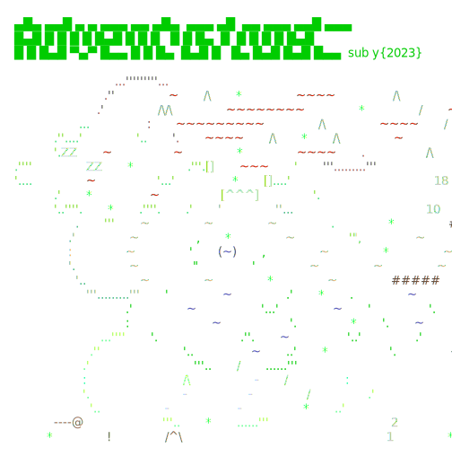

# 🎄🎅🎄 Advent of Code 2023 🎄🎅🎄

Advent of Code is an annual set of Christmas-themed computer programming challenges that follow an
Advent calendar. It has been running since 2015.

You can read more about this event on [Wiki](https://en.wikipedia.org/wiki/Advent_of_Code]), access
the [Advent of Code page](https://adventofcode.com/) or watch this presentation by Eric Wastl, the
creator of the
challenge: [Advent of Code: Behind the Scenes](https://www.youtube.com/watch?v=_oNOTknRTSU).

# Advent of Code 2023

Programming Language: ❤️JAVA ❤️

           